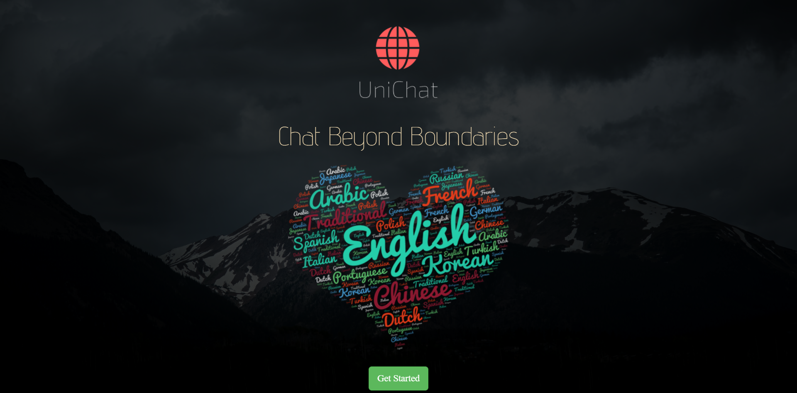
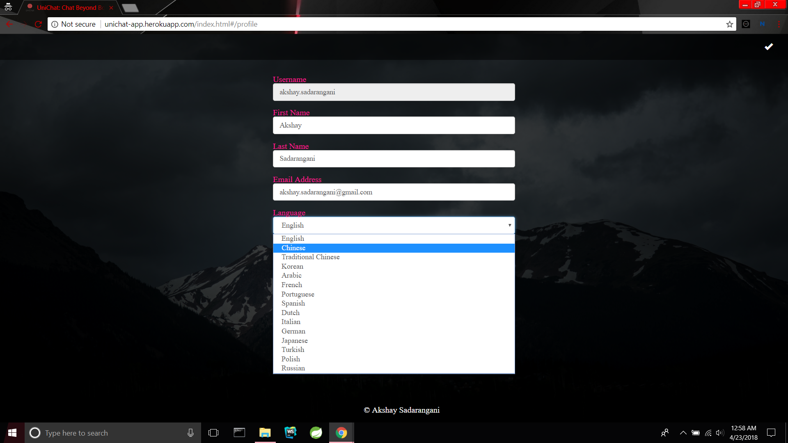
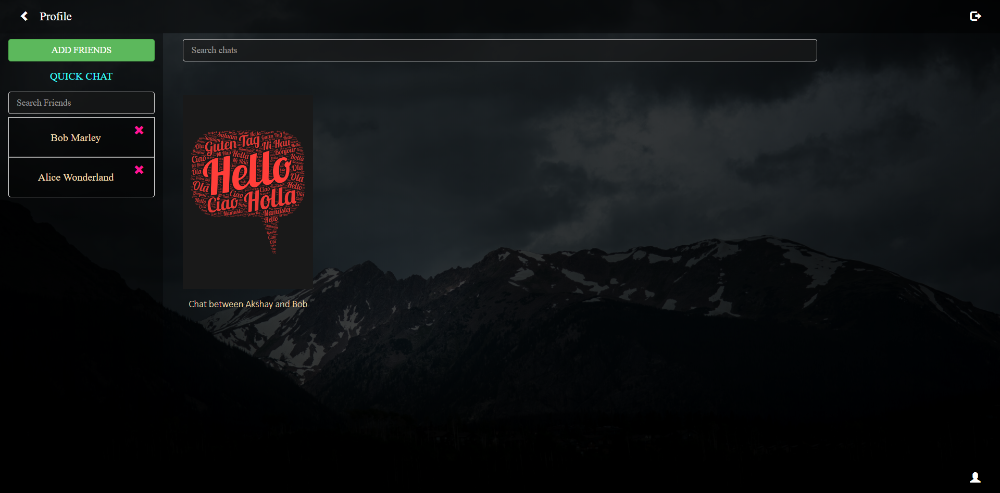
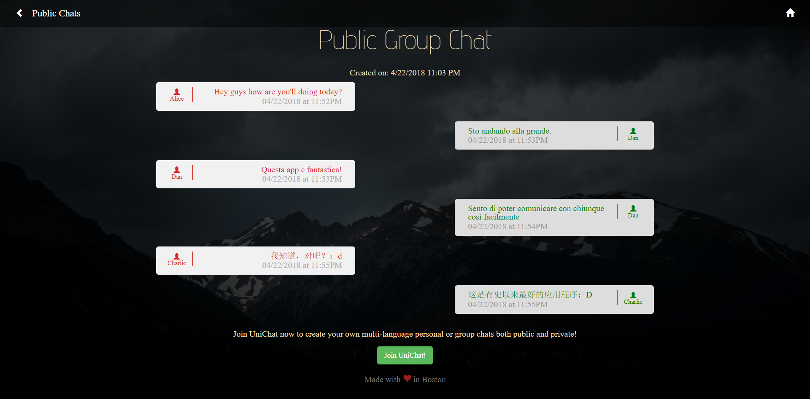
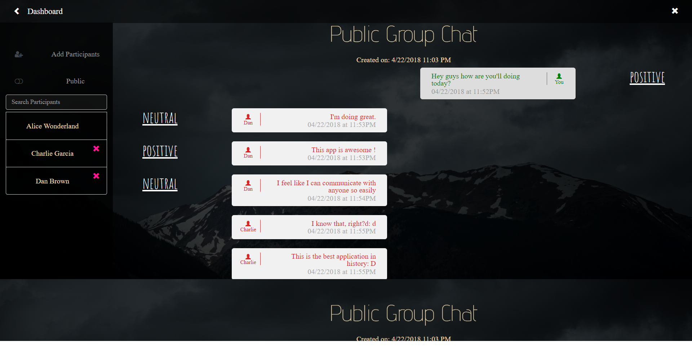
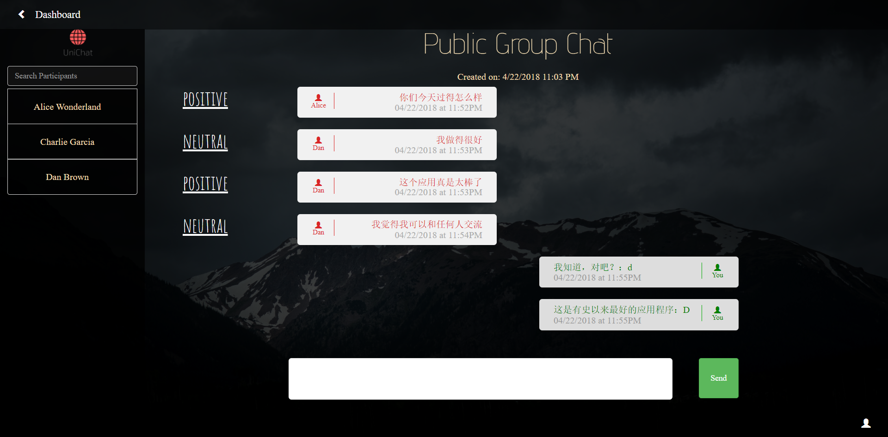
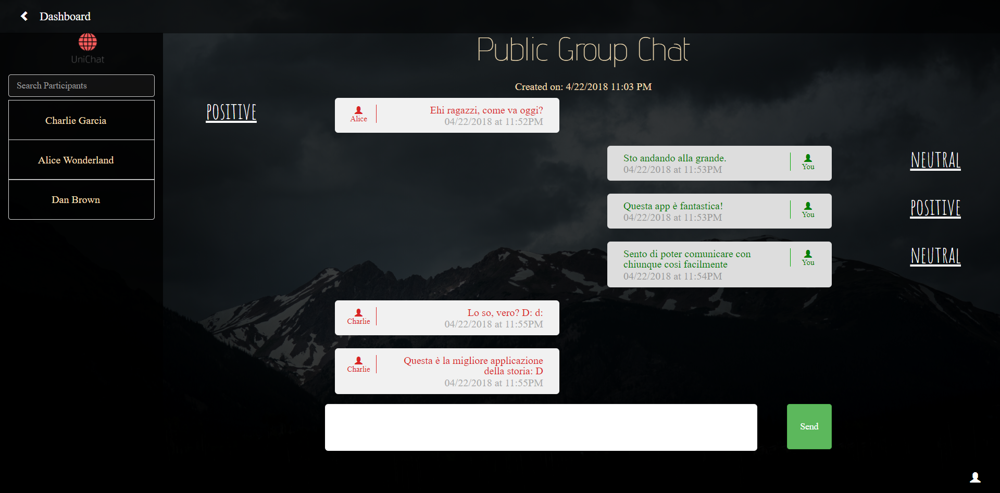

# UniChat - Chat Beyond Barriers
## Introduction
A MEAN stack web app which lets users chat with each other either or in a group either privately or publicly in their native language. With a choice of 15 languages to choose from, chatting especially with a multicultural crowd has never been easier. Messages are translated as per user's preferred language and have associated sentiments alongside to give a better idea of the tone of the message as translations today aren't perfect.
## Active Link
[UniChat](https://unichat-app.herokuapp.com).
## Screenshots

### Public Anonymous View

### Participant View (English)

### Participant View (Chinese)

### Participant View (Italian)

### Add Friends

### Add Chat Participants

### Admin Activities

### Check out the [demo video](https://youtu.be/2RYWygWJxso)
## Bugs and Feedback
For bugs, questions and discussions please use the [Github Issues](https://github.com/aksh4y/unichat/issues).
